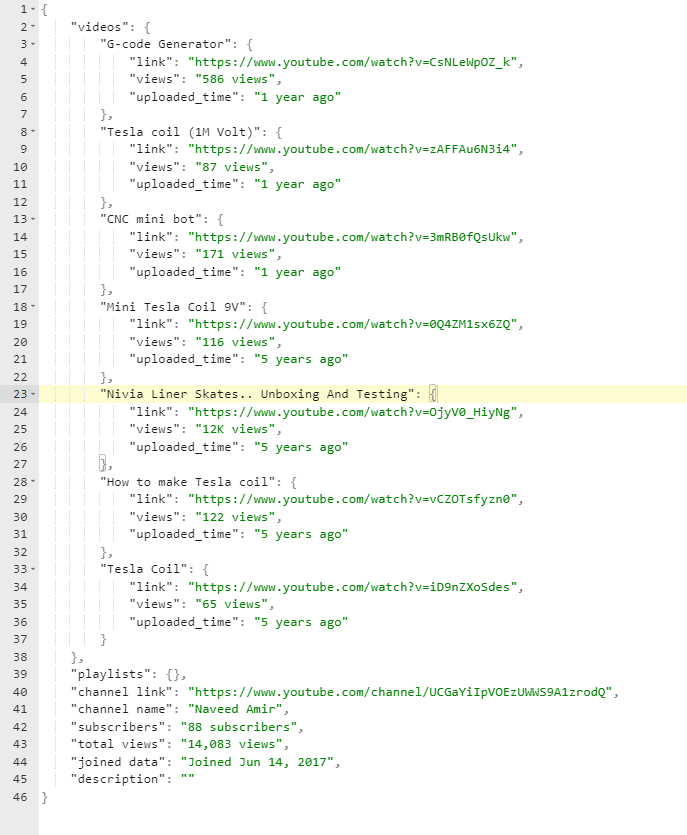
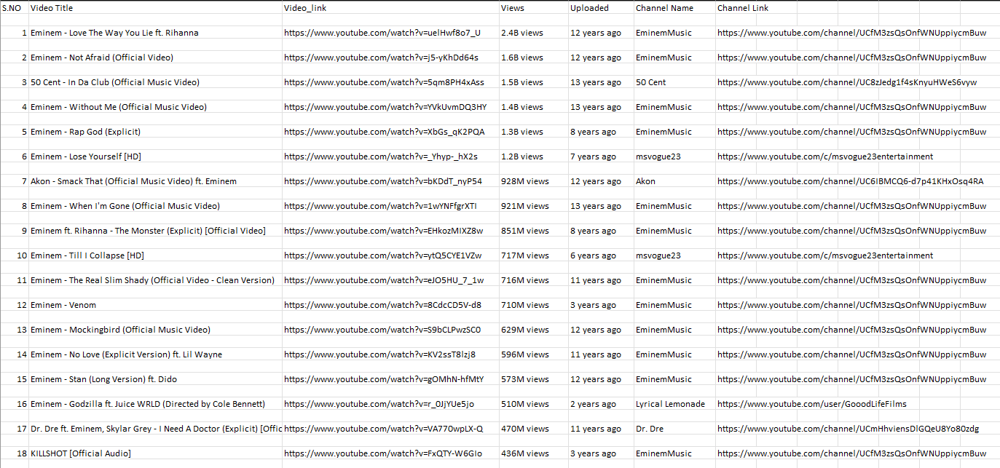
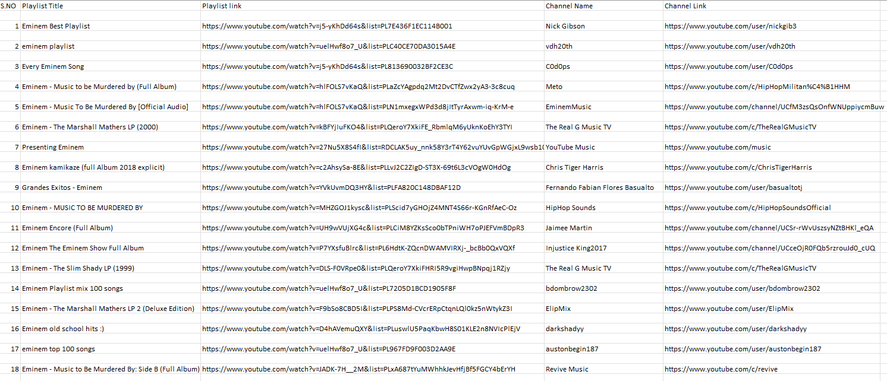
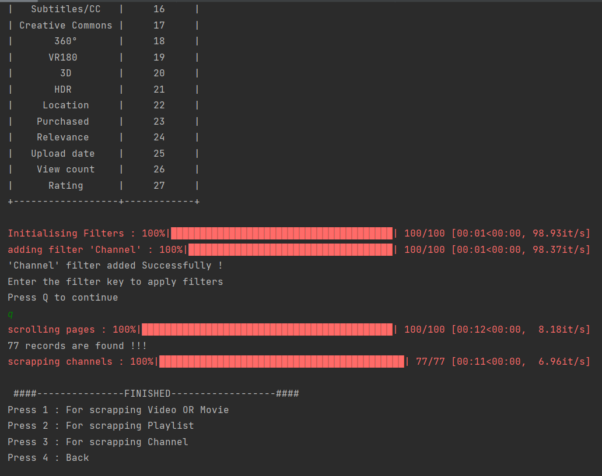

# Youtube-Scrapper-Bot

<h3>
This bot could quickly collect information from YouTube. There are basically two scrapping modes that I implemented.
1. By utilising a keyword search, you can scrape the data.
2. By utilising an exclusive channel link
</h3>

First mode could be used to get the data using keyword search technique.
This mode was further separated into the types of data that were needed, 
including scraping channels, playlists, and videos. And the data output saved 
in a CSV format file. Additionally, we can use other filters while conducting a search.

The easier mode is the second. All the information pertaining to a specific YouTube channel,
including all videos with links, all playlists with links, the total number of subscribers, 
the total number of views, and many other things, may be readily provided by this. It offers JSON-formatted data.

<h4>  This is ds </h4>
  <kbd></kbd>

  <kbd></kbd>

  <kbd></kbd>

  <kbd></kbd>

